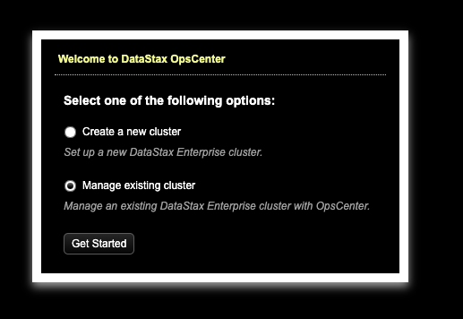
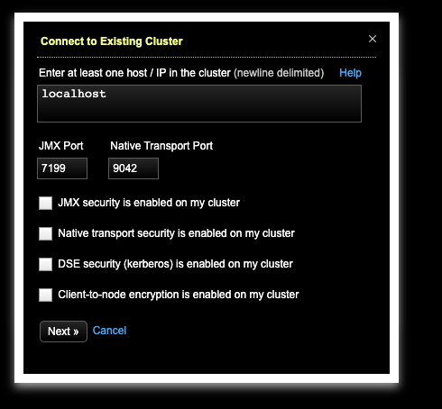

Installing OPS center
---------------

== STEP 1) add yum repository

## Step 1: Add apt repository


```bash
echo "deb https://debian.datastax.com/enterprise \
stable main" | sudo tee -a /etc/apt/sources.list.d/datastax.sources.list
```


## Step 2: Add datastax Repository Key

``` bash
curl -L https://debian.datastax.com/debian/repo_key | sudo apt-key add -
```


## Step 3: Use Apt to install


```bash
sudo apt-get update
sudo apt-get install opscenter
```


## Step 4: Change he port

Currently on our machines port 8888 is occupied, so let's change the port to 8889

Use a text editor (vi, vim, nano, etc) to edit the file `/etc/opscenter/opscenterd.conf`

```bash
sudo /etc/opscenter/opscenterd.conf
```


Change port `8888`  to `8889` and save.  (`:wq` in vim)


save and exit


```bash
sudo service opscenterd restart
```

## Step 4: Browse to your host `http://<opscenter-host>:8889/

```
http://<opscenter-host>:8889/
```



You will select Manage existing cluster

## Step 5: Select your existing cluster




## Step 5: Observe metrics
j
Once opscenter is functional, re-run benchmark from 'post-install.txt'.
Observe metrics on ops-center

== Troubleshooting ==

Agent install failing?
we have to install ops-center manually
Follow these instructions:

1) install 'agents'in ops-center webui  (top, center)
it will say '0 agents connected'click on 'fix'
Click on 'credentials'
Enter  user-name / password you used to login to the cluster
Click 'install'

if the above fails, try these steps


2) remove existing opscenter
  sudo yum remove opscenter

3)  install the downloaded ops center
sudo yum install ~/software/cassandra/opscenter-5.0.1-1.noarch.rpm

(if the rpm file is not there, download it using
  $   curl -O http://rpm.datastax.com/community/noarch/opscenter-5.0.1-1.noarch.rpm
)

4)  sudo vi /etc/opscenter/opscenterd.conf
change interface = 127.0.0.1 to interface = 0.0.0.0

5) sudo service opscenterd start

6) go to the Ops center UI  and install the agent
